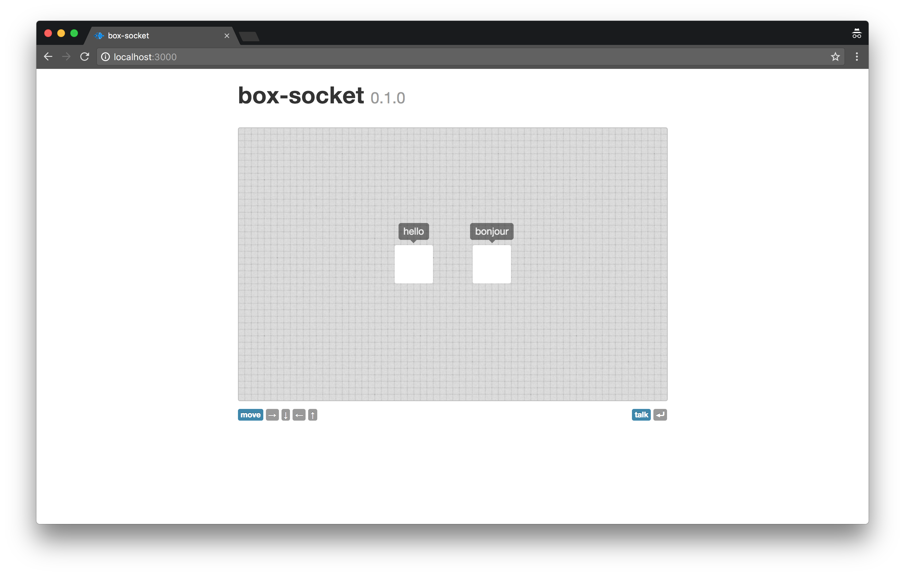

# Box Socket

A simple demonstration of real-time multiplayer interaction with Node.js and WebSockets.

Created August 2012.

## dependencies

### back end

* [socket.io](http://socket.io)
* [express](https://npmjs.org/package/express)
* [ejs](https://npmjs.org/package/ejs)
* [less](https://npmjs.org/package/less)
* [connect-assets](https://npmjs.org/package/connect-assets)
* [express-partials](https://npmjs.org/package/express-partials)

### front end

* [jquery](http://jquery.com)
* [bootstrap](https://github.com/twitter/bootstrap)
* [prefixfree](https://github.com/LeaVerou/prefixfree)
* [keymaster](https://github.com/madrobby/keymaster)

## License

ISC
